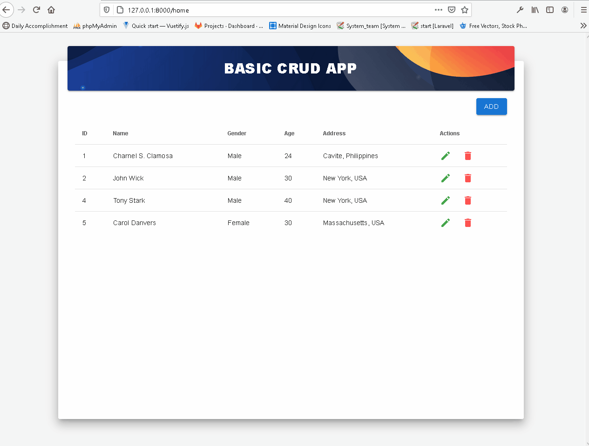

# RESTful API.

RESTful API that handles basic CRUD functions.

## Getting Started

These instructions will get you a copy of the project up and running on your local machine for development and testing purposes. See the instructions below for notes on how to deploy the project on a live system.

## Preview


### Prerequisites

Things you need to be able to use this project:
* [Chrome](https://www.google.com/intl/en_ph/chrome/) or [Firefox](https://www.mozilla.org/en-US/firefox/new/)
* [Yarn](https://classic.yarnpkg.com/en/docs/install/#windows-stable)
* [PHP](https://www.php.net/)
* Command prompt
### Installation
Type this in cmd:
```
cd../Project
```
```
yarn install
```
After that, go to your local host phpMyAdmin
```
create a database with a name of 'crud'
```


Last is go back to cmd and type:
```
php artisan db:seed
```
```
php artisan migrate
```
```
php artisan serve
```
## Built With
* [Vue](https://vuejs.org/)
* [Vuetify](https://vuetifyjs.com/en/)
* [Vuex](https://vuex.vuejs.org/)
* [Vue Router](https://router.vuejs.org/)
* [Laravel](https://laravel.com/)
## Authors
* **Charnel Clamosa** - [charnelclamosa](https://github.com/charnelclamosa)
## License
This project is licensed under the MIT License - see the [LICENSE.md](LICENSE.md) file for details